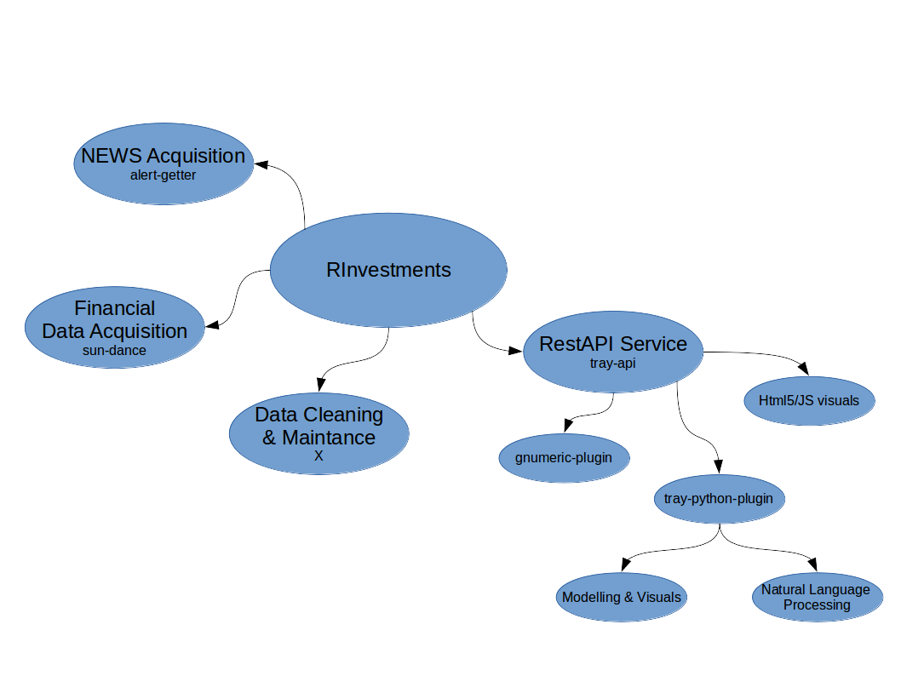

# RInvestments - General Documentation

This repo is just meant to hold documentation in general. Every module
will have its own documentation, which I will make an effort to be up to date.
Here you will get info on general structure of the system, roadmap etc. 

